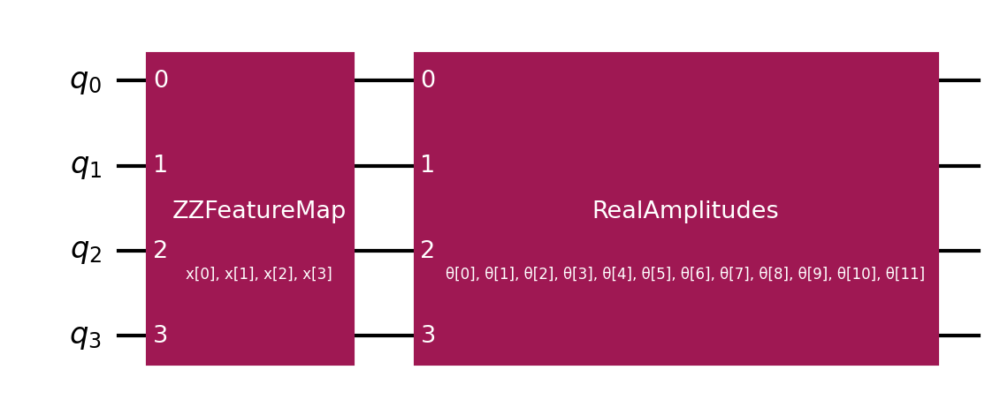

# Qiskit GPT Nano

This is  a test for a quantum-enhanced GPT model using Qiskit.

A drop-in quantum enhancement for your GPT implementation using Qiskit quantum computing.

## 🎯 What This Does

Replaces the self-attention mechanism in your original GPT with quantum-enhanced attention using parameterized quantum circuits, while maintaining the exact same interface.

The goal is to see if we can get a quantum-enhanced GPT model to perform better than a classical GPT model, namely in terms of loss and throughput.


## Results


- Classical loss: 3.3506 (wall: 0.6s, cpu: 1.2s, rss_max: 355.8 MB)
- Quantum loss: 3.3545 (wall: 224.8s, cpu: 574.5s, rss_max: 410.1 MB)
- Classical params: 8,769
- Quantum params: 8,821
- Classical throughput: 11190.8 tokens/s
- Quantum throughput: 28.5 tokens/s

## Output Difference Stats

- Hamming distance (tokens, first 121): 60
- Agreement ratio: 0.504
- Jaccard overlap (token sets): 0.500
- Levenshtein distance (chars): 60

## 🚀 Quick Start

```bash
# Install dependencies
pip install -r requirements.txt

# Download Shakespeare dataset
make data

# Train both classical & quantum (with profiling and auto CPU threading)
python train.py

# View results & profiles
open models/results.md  # or inspect in your editor
```

## 🧵 CPU Threads and Aer

- Auto uses all CPU cores by default. Override:
  - `NUM_THREADS=12 AER_THREADS=12 python train.py`
- Aer is used for quantum primitives when installed:
  - `pip install qiskit-aer`

## 📁 Files

| File | Description |
|------|-------------|
| `train.py` | Primary entrypoint: trains classical and quantum, profiles, writes `models/results.md` |
| `src/quantum_gpt_implementation.py` | Model code (ClassicalGPT, QuantumGPT, heads, Aer Estimator) |
| `src/train_quantum_gpt.py` | Legacy quantum-only training/generation interface |
| `src/test_quantum_gpt.py` | Test suite |
| `src/evaluavate_components.py` | Component evaluation (classical vs quantum) |
| `src/generate_classical.py` | Generate text from classical checkpoint |
| `src/draw_quantum_circuit.py` | Save quantum attention circuit diagram |
| `models/results.md` | Training results, profiling and diff stats |

## 🧠 Architecture

- **QuantumAttentionHead**: Quantum attention using Qiskit EstimatorQNN
- **Hybrid Model**: Mix of quantum and classical attention heads
- **Fallback**: Graceful degradation to classical attention if quantum fails
- **Same Interface**: Drop-in replacement for your original GPT

## 🎛️ Configuration

```python
# Quantum-optimized hyperparameters
batch_size = 4      # Reduced for quantum simulation
n_embd = 32         # Reduced embedding dimension  
n_head = 4          # Number of attention heads
n_qubits = 4        # Quantum circuit qubits
```

## 📊 Results

- Latest training report is written to `models/results.md` after `python train.py`.
- Includes: losses, param counts, throughput, CPU/wall time, max RSS, output difference stats, and cProfile summaries for classical and quantum.

## 🔬 Circuit Diagram

The quantum attention circuit is saved by:
```bash
make draw
```
Result:



(Text diagram saved at `models/quantum_attention_circuit.txt`.)

## 🧪 Testing

```bash
python src/test_quantum_gpt.py
```

## ▶️ Entrypoints

- Training and report: `python train.py`
- Classical generation: `python src/generate_classical.py "First Citizen:"`
- Legacy quantum-only training: `python src/train_quantum_gpt.py`
- Legacy quantum-only generate: `python src/train_quantum_gpt.py generate "ROMEO:"`
- Component evaluation: `python src/evaluavate_components.py`
- Draw circuit: `python src/draw_quantum_circuit.py` or `make draw`

Makefile shortcuts:
- `make install` — install deps
- `make data` — fetch dataset
- `make train` — same as `python train.py`
- `make report` — same as `python train.py`
- `make generate` — legacy quantum-only generate
- `make generate_classical` — classical generate with prompt
- `make evaluate` — component evaluation
- `make draw` — save circuit image and text
- `make clean` — cleanup

## 🚨 Troubleshooting

**Qiskit not installed?**
```bash
pip install qiskit qiskit-machine-learning qiskit-aer
```

**Low CPU utilization?**
- Increase threads: `NUM_THREADS=12 AER_THREADS=12 python train.py`
- Increase batch size slightly if RAM allows in `src/quantum_gpt_implementation.py`.

**Out of memory?**
- Reduce `batch_size` to 2
- Reduce `n_qubits` to 3
- Use CPU: `device='cpu'`

**Slow training?**
- Use Aer (`pip install qiskit-aer`)
- Use fewer qubits for development
- Test with smaller datasets first

## 📖 Learn More

- [Qiskit Documentation](https://qiskit.org/documentation/)
- [Original GPT Tutorial](https://karpathy.ai/zero-to-hero.html)

---

**Ready to explore quantum language modeling?** Start with `python train.py`! 🎯
